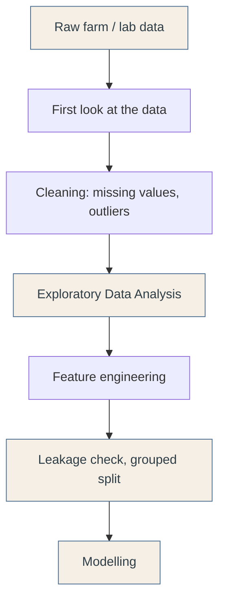

# Md Raihan Patwary

**Animal Nutrition &amp; Machine Learning**

## About me

Connecting animal science research with machine learning.

I started with feed, animals and nutrition trials. Along the way I became convinced that data driven methods are the future of animal science, and that the field needs more people who can stand on both sides, the farm and the notebook.

Everything on the machine learning side is self taught. The coding, the statistics and the models, I learned all of it on my own, and I point it at the production problems I already understand.

## Research focus

- Animal Nutrition & Feed Science
- Precision Livestock & Data-Driven Animal Science
- Biological Data Science & Predictive Modeling

## How I work

Most of the work happens before the model. Preprocessing decides everything that comes after it, so I work carefully through it. I can take different kinds of farm and laboratory data and prepare each one properly, so that the model is built on something trustworthy.

## Research toolkit

**Language & IDE**

**Data handling**

**Modelling**

**Working environment**

**Data sources**

## Acknowledgment

A small acknowledgment to the people who made machine learning easier for me to understand.

Josh Starmer (StatQuest) · Andrew Ng · Krish Naik
